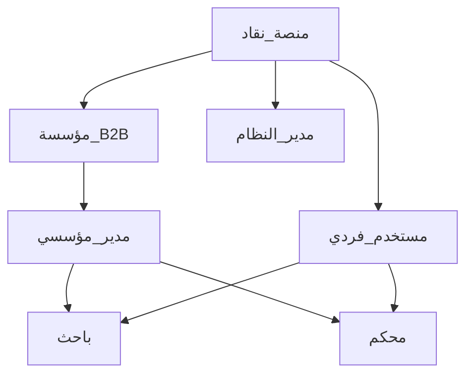
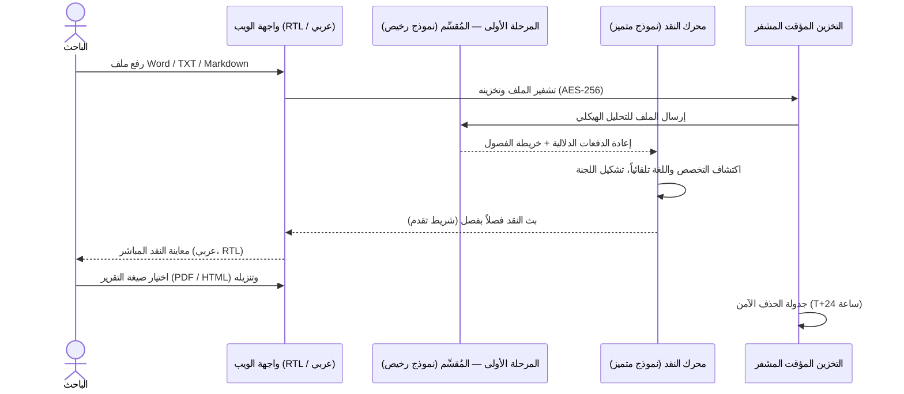
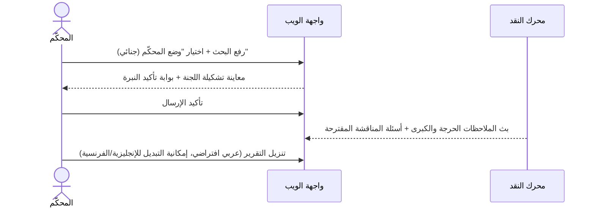
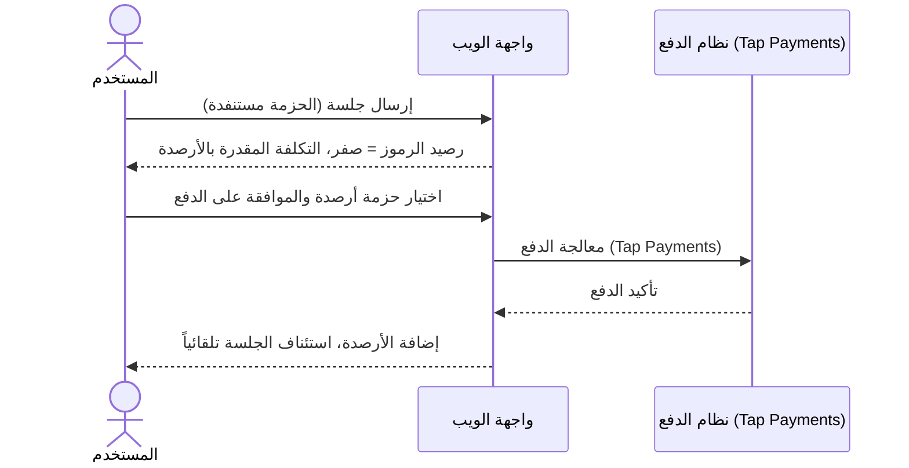
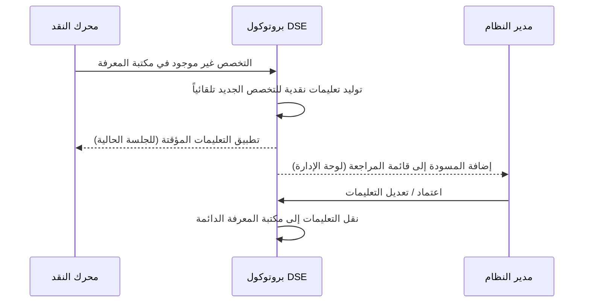
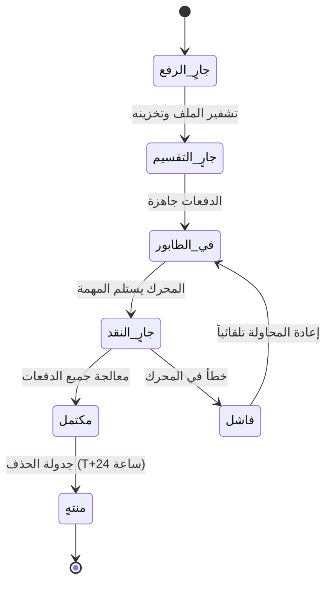
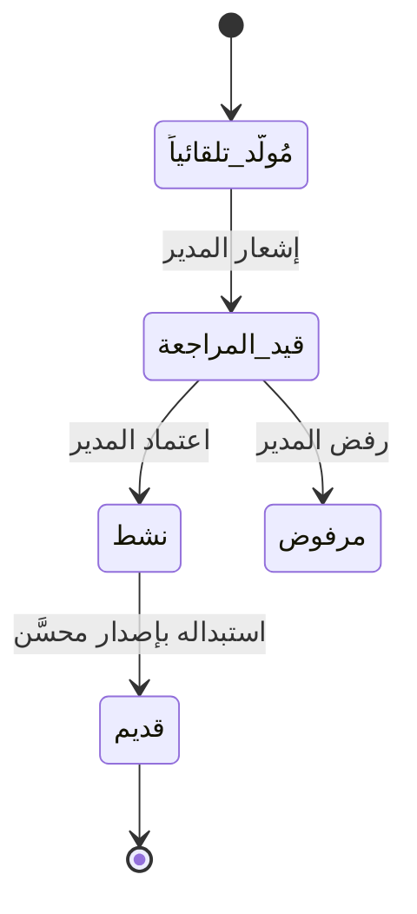

# وثيقة متطلبات المنتج — نَقّاد: منصة التحكيم الأكاديمي بالذكاء الاصطناعي (عربي أولاً)

**الغرض من الوثيقة:** بداية منتج جديد — توحيد رؤية الفريق الكاملة قبل الشروع في بناء أي ميزة.
**المخرج:** نموذج ذهني مشترك — وليس قائمة مهام.

**الرقم التعريفي:** PRD-001-AR
**النوع:** عالي المستوى (High-Level)
**الكاتب:** إدارة المنتج
**التاريخ:** 16 يونيو 2026
**الحالة:** مسودة — بانتظار المراجعة
**الإصدار المستهدف:** الربع الرابع 2026 (المرحلة الأولى)
**الإصدار:** 1.0

## سجل التغييرات
| الإصدار | التاريخ | الكاتب | التغييرات |
|---|---|---|---|
| 1.0 | 16 يونيو 2026 | إدارة المنتج | المسودة الأولى |

---

## 1. نظرة عامة

**نَقّاد** هو منصة ذكاء اصطناعي سيادية تعمل بمبدأ "عربي أولاً"، وتضطلع بدور **مجلس المناقشة الافتراضي** للأبحاث الأكاديمية. يرفع الباحثون والمحكمون رسائلهم وأوراقهم البحثية، فيحصلون في غضون دقائق على نقد أكاديمي متخصص من لجنة متعددة التخصصات يُشكَّلها ديناميكياً — باللغة العربية افتراضياً — مع ضمان موثوق بحذف جميع الملفات نهائياً بعد 24 ساعة.

تستهدف المنصة السوق الأكاديمية في منطقة الشرق الأوسط وشمال أفريقيا أولاً، حيث لا تلبّي أي أداة حالية الحاجة إلى تحكيم أكاديمي سريع وسري ومتعمق باللغة العربية.

---

## 2. بيان المشكلة

يعاني الباحثون الناطقون بالعربية من أربع مشكلات متراكمة:

1. **فجوة التخصصات البينية:** المشرفون الأكاديميون خبراء في مجالاتهم الضيقة فقط، مما يُخلّ بمراجعة الأبحاث متعددة التخصصات.
2. **بطء التغذية الراجعة:** انتظار أسابيع أو شهور للحصول على نقد تفصيلي يُعيق تقدم الطالب.
3. **سطحية الأدوات الحالية:** أدوات الذكاء الاصطناعي العامة عاجزة عن استيعاب وثيقة من ألف صفحة كسياق متكامل، وتُهلوس في توثيق المراجع.
4. **هاجس الخصوصية:** يخشى الباحثون رفع أعمالهم غير المنشورة إلى منصات سحابية قد تحتفظ ببياناتهم — مخاوف راسخة في بيئة البحث العلمي بمنطقة الشرق الأوسط.

لا يوجد منتج حالي يعالج هذه المشكلات الأربع معاً، ولا أيٌّ منها يأتي بمنهج "عربي أولاً".

---

## 3. النموذج التجاري

**نوع النموذج:** B2C (أساسي — المرحلة الأولى) + B2B مؤسسي (المرحلة الثانية)

**التسلسل الهرمي للأدوار:**

### باقات الأسعار

**النموذج:** اشتراك شهري (SaaS) مع حزمة رموز (Tokens) لكل باقة. عند استنفاد الحزمة الشهرية، يستمر المستخدم بالخدمة عبر رصيد الأرصدة (Credits) المشتراة مسبقاً.

| الباقة | السعر (دولار/شهر) | حزمة الرموز الشهرية | تكلفة الأرصدة عند الاستنفاد | ملاحظات |
|---|---|---|---|---|
| **مجاني** | $0 | حد أقصى 20 صفحة للجلسة | غير متاح | BYOK فقط (مفتاح API المستخدم)، مخرجات مختومة بعلامة مائية |
| **باحث** | $9 | 500 ألف رمز (~150 صفحة) | $0.02 / 1000 رمز | جميع أعماق التقارير، وضع باحث فقط |
| **محقق** | $29 | 2 مليون رمز (~600 صفحة) | $0.016 / 1000 رمز | وضعا الباحث والمحكّم، أولوية في الطابور |
| **عالِم** | $79 | 8 ملايين رمز (~2400 صفحة) | $0.012 / 1000 رمز | وصول كامل، رفع دليل كتابة مؤسسي، صلاحية API |

**حزم الأرصدة** (تُشترى في أي وقت وتبقى صالحة بلا انتهاء):
- 1 مليون رمز ← $15
- 5 ملايين رمز ← $60
- 20 مليون رمز ← $200

**قواعد الفوترة الجوهرية:**
- رموز المرحلة الأولى (المُقسِّم الرخيص) لا تُحتسب على المستخدم — هي تكلفة المنصة.
- رموز المرحلة الثانية فقط (النقد الفعلي) تُخصم من الحزمة أو الأرصدة.
- الأرصدة المشتراة لا تنتهي. الحزمة الشهرية غير قابلة للترحيل.
- مستخدمو الباقة المجانية لا يستطيعون شراء أرصدة — يجب الترقية إلى باقة مدفوعة.

---

## 4. الأهداف التجارية

1. ترسيخ **نَقّاد** بوصفه الأداة الأولى للتحكيم الأكاديمي بالذكاء الاصطناعي في السوق الخليجية ومنطقة الشرق الأوسط وشمال أفريقيا خلال 12 شهراً من الإطلاق.
2. تحقيق **اقتصاديات وحدة إيجابية** لكل جلسة نقد منذ اليوم الأول، عبر خط أنابيب النموذجين (مُقسِّم رخيص ← نموذج نقد متميز).
3. بناء **مكتبة معرفية تخصصية** (مخرجات بروتوكول DSE) تشكّل ميزة تنافسية متراكمة — كل تخصص جديد يُحلَّل يُحسِّن المنصة لجميع المستخدمين المستقبليين.
4. تقديم **منتج يبني الثقة بالتصميم**: بنية الصفر احتفاظ بالبيانات ليست مجرد متطلب امتثال، بل هي ورقة تسويقية مميِّزة.
5. استهداف الحسابات المؤسسية (B2B) ابتداءً من المرحلة الثانية — الجامعات ومراكز البحث كعملاء اشتراك.

---

## 5. مقاييس النجاح

| المقياس | القيمة الأساسية | الهدف (6 أشهر بعد الإطلاق) |
|---|---|---|
| وقت اكتمال النقد (100 صفحة) | — | أقل من 5 دقائق |
| نسبة الجلسات باللغة العربية | — | 80% أو أكثر |
| تكلفة الرموز لكل جلسة (100 صفحة) | — | 40% أو أقل من تكلفة النموذج الواحد |
| مؤشر رضا المستخدمين (تغذية راجعة داخل التقرير) | — | 4.2 / 5 أو أعلى |
| نجاح توليد DSE لتخصص جديد تلقائياً | — | 90% أو أكثر في المحاولة الأولى |
| معدل تحويل المجاني ← مدفوع | — | 12% أو أكثر |
| معدل شراء الأرصدة عند استنفاد الحزمة | — | 35% أو أكثر |
| معدل امتثال الحذف التلقائي بعد 24 ساعة | — | 100% (قابل للتدقيق) |

---

## 6. أدوار المستخدمين والصلاحيات

| الدور | الوصف | الهدف الجوهري |
|---|---|---|
| **باحث (Researcher)** | طالب أو باحث مستقل يرفع عمله الخاص | نقد بنّاء لتحسين البحث قبل التسليم أو المناقشة |
| **محكّم (Reviewer)** | مناقش في لجنة، أو محكّم في مجلة، أو خبير خارجي | نقد جنائي لكشف الثغرات وتوليد أسئلة المناقشة |
| **مدير مؤسسي** | مدير حساب جامعة أو مركز بحثي | رفع دليل الكتابة المؤسسي، ضبط الإعدادات الافتراضية، مراقبة الاستخدام |
| **مدير النظام** | الفريق الداخلي للمنصة | اعتماد تعليمات التخصصات الجديدة (DSE)، مراقبة صحة النظام، إدارة الفوترة |

**مصفوفة الصلاحيات:**

| الإجراء | باحث | محكّم | مدير مؤسسي | مدير النظام |
|---|---|---|---|---|
| رفع بحث (Word / TXT / Markdown) | ✓ | ✓ | — | — |
| اختيار تشكيلة اللجنة | ✓ | ✓ | — | — |
| اختيار عمق التقرير | ✓ | ✓ | — | — |
| تحديد نبرة النقد (بنّاء / جنائي) | ✓ | ✓ | — | — |
| تنزيل التقرير (PDF / HTML) | ✓ | ✓ | — | — |
| شراء أرصدة أو ترقية الباقة | ✓ | ✓ | ✓ | — |
| رفع دليل الكتابة المؤسسي | — | — | ✓ | ✓ |
| اعتماد تعليمات التخصصات الجديدة (DSE) | — | — | — | ✓ |
| عرض الاستخدام الكلي وطابور المهام | — | — | ✓ | ✓ |
| إدارة حسابات المستخدمين والأرصدة | — | — | — | ✓ |

---

## 7. رحلات المستخدم الجوهرية

### 7.1 الباحث: رفع البحث والحصول على النقد

### 7.2 المحكّم: النقد الجنائي للفحص الأكاديمي

### 7.3 استنفاد الحزمة — سير عملية الأرصدة

### 7.4 بروتوكول DSE: توليد تخصص جديد تلقائياً

---

## 8. نظرة عامة على الحل

1. **واجهة عربية أولاً:** واجهة ويب مصممة أصلاً للاتجاه RTL من الصفر — لا ترجمة قسرية لواجهة LTR. العربية هي اللغة الافتراضية؛ الإنجليزية والفرنسية متاحتان عبر مُبدِّل اللغة.
2. **خط أنابيب نموذجين:** نموذج رخيص أو محلي (Mistral-small / Gemma-3) يُقسِّم الوثيقة إلى دفعات دلالية. نموذج متميز (Gemini / Claude) يُنفِّذ النقد على الدفعات فقط. رموز المرحلة الأولى لا تُحتسب على المستخدم.
3. **تشكيل لجنة ديناميكية:** تكتشف المنصة تخصص البحث تلقائياً وتجمع ما يصل إلى ثلاثة خبراء افتراضيين (مثلاً: فقيه + خبير لغوي + متخصص ميداني) وتدمج تعليماتهم عبر بروتوكول التوليف الهجين.
4. **بروتوكول DSE التعلّمي:** عند اكتشاف تخصص جديد، يولّد النظام معاييره النقدية تلقائياً ويخدم المستخدم الحالي فوراً بالمسودة، ثم يُحيلها إلى المدير للاعتماد قبل التبني الدائم.
5. **معالجة النص ثنائي الاتجاه:** يُعامَل النص المختلط (عربي + لاتيني) باعتباره الحالة الطبيعية لا الاستثناء — النص العربي، والمصطلحات الإنجليزية، والمراجع اللاتينية، والمعادلات الرياضية، كلها تُعالج بشكل صحيح في التحليل والمخرجات.
6. **بنية الصفر احتفاظ:** كل ملف وتقرير مُشفَّر في السكون (AES-256) ومُنقَّل عبر TLS 1.3 ويُحذف حذفاً آمناً بعد 24 ساعة دون استثناء.
7. **مخرجات مرنة:** التقارير تُصدَر بصيغة PDF (طباعة عربية محسَّنة) و/أو HTML (قابل للتضمين والمشاركة). المدخلات: Word (.docx) أو نص عادي (.txt) أو Markdown (.md) فقط — لا يُقبَل رفع ملفات PDF.

---

## 9. قواعد العمل

- **الاحتفاظ الصارم بالبيانات:** لا يمكن استعادة أي ملف أو تقرير بعد مرور 24 ساعة تحت أي ظرف. غير قابل للتفاوض.
- **نزاهة البحث:** النظام يُقدِّم نقداً ومقترحات فقط — لا يكتب البحث نيابة عن المستخدم.
- **فوترة الرموز:** رموز المرحلة الأولى (التقسيم) لا تُحتسب على المستخدم. رموز المرحلة الثانية فقط (النقد) تُخصم من الحزمة أو الأرصدة.
- **الأرصدة لا تنتهي:** حزمة الرصيد المشتراة تبقى صالحة إلى أجل غير مسمى. الحزمة الشهرية لا تُرحَّل.
- **ملكية مكتبة DSE:** كل مجموعة تعليمات تخصص مُعتمدة تصبح ملكاً لمكتبة المنصة المشتركة، لا لأي مستخدم بعينه.
- **الاستخدام العادل للباقة المجانية:** حسابات BYOK مُقيَّدة بحد طلبات في الساعة لمنع استغلال الموارد. مستخدمو الباقة المجانية لا يستطيعون شراء أرصدة.
- **العربية افتراضياً:** جميع الحسابات الجديدة تبدأ بواجهة عربية ومخرجات تقارير عربية ما لم يُغيَّر ذلك صراحةً.
- **بوابة النبرة:** يجب على المستخدم الإقرار صراحةً بنبرة النقد (بنّاء / جنائي) في شاشة الإرسال قبل تشغيل الجلسة. يُسجَّل هذا الإقرار.
- **صيغ الرفع المقبولة فقط:** Word (.docx)، نص عادي (.txt)، Markdown (.md). لا يُقبَل رفع PDF في المرحلة الأولى.

---

## 10. مسارات الحالات

### 10.1 جلسة النقد

### 10.2 تعليمات تخصص DSE

| الحالة | تسمية لوحة الإدارة | قيمة API |
|---|---|---|
| مُولَّد_تلقائياً | قيد الإنشاء التلقائي | `draft` |
| قيد_المراجعة | بانتظار المراجعة | `pending_review` |
| نشط | نشط | `active` |
| مرفوض | مرفوض | `rejected` |
| قديم | قديم | `deprecated` |

---

## 11. التصميم

### الويب (المنصة الأساسية — المرحلة الأولى)

- **الصفحة الرئيسية / التسجيل** — قسم بطولي عربي، تسجيل الدخول / إنشاء حساب، بانر ضمان عدم الاحتفاظ بالبيانات، صفحة الأسعار
- **لوحة التحكم (الرئيسية)** — الجلسات النشطة، رصيد الرموز + شارة الباقة، آخر التقارير، عرض ترقية الأرصدة عند انخفاض الرصيد
- **رفع وضبط البحث (رفع بحث)** — رفع الملف (Word / TXT / MD) ← معاينة التخصص واللغة المكتشفَين تلقائياً ← بطاقة تشكيلة اللجنة ← بوابة النبرة ← اختيار عمق التقرير ← إرسال
- **عرض النقد** — بث النقد فصلاً بفصل، شارات درجة الخطورة (حرجة / كبرى / صغرى / تحريرية)، شريط تقدم لكل فصل، عداد استهلاك الرموز
- **التقرير** — التقرير الكامل المهيكل، تنزيل PDF أو HTML، تغذية راجعة داخل التقرير (إعجاب/تعليق)
- **الاشتراك والرصيد** — الباقة الحالية، استهلاك الرموز هذا الشهر، رصيد الأرصدة، ترقية / شراء أرصدة (Tap Payments)
- **لوحة الإدارة** — قائمة مراجعة DSE، لوحة صحة النظام، إدارة المستخدمين، تحليلات الاستخدام

اتجاه الواجهة: RTL أصيل. الويب متجاوب مع الهواتف — لا تطبيق محلي في المرحلة الأولى، لكن الويب يجب أن يعمل كاملاً على متصفحات الهواتف.

**Figma:** قيد التحديد

---

## 12. نموذج البيانات الكلي

- **المستخدم:** صاحب الحساب؛ له دور (باحث / محكّم)، تفضيل اللغة، الباقة الحالية، رصيد الرموز (شهري + أرصدة)، ارتباط مؤسسي اختياري
- **الاشتراك:** يربط المستخدم بباقة؛ يتتبع دورة الفوترة وحصة الرموز الشهرية وتاريخ التجديد
- **سجل الأرصدة:** سجل خصم/إضافة لكل مستخدم؛ مرتبط بأحداث Tap Payments واستهلاك رموز الجلسات
- **المؤسسة:** حساب B2B (المرحلة الثانية)؛ تمتلك دليل كتابة؛ لها مدير أو أكثر وأعضاء
- **جلسة النقد:** الكيان الجوهري؛ يربط مستخدماً بملف مرفوع وتشكيلة لجنة ونبرة وعمق تقرير؛ له دورة حياة بحالات؛ ينتهي صلاحية بعد 24 ساعة
- **الملف المرفوع:** مرجع blob مشفَّر (Word / TXT / MD)؛ ينتمي لجلسة واحدة؛ يُحذف عند انتهاء الجلسة
- **الدفعة (Chunk):** وحدة هيكلية ينتجها مُقسِّم المرحلة الأولى؛ تنتمي لجلسة؛ تحمل بيانات وصفية للفصل/القسم وعدد الرموز
- **تقرير النقد:** مخرج مهيكل لكل جلسة؛ قابل للتصدير كـ PDF وHTML؛ يُحذف مع الجلسة بعد 24 ساعة
- **تعليمات التخصص:** معيار نقد مُولَّد بواسطة DSE أو بشري؛ له حالة اعتماد؛ ينتمي لمكتبة المعرفة الدائمة للمنصة

---

## 13. نقاط التكامل

| النظام | الغرض |
|---|---|
| **نموذج المرحلة الأولى** (Mistral-small / Gemma-3 / محلي) | التحليل الهيكلي والتقسيم الدلالي — رخيص، حجم كبير، لا يُحتسب على المستخدم |
| **نموذج المرحلة الثانية** (Gemini / Claude) | توليد النقد — متميز، رموزه تُحتسب على حزمة المستخدم / أرصدته |
| **Tap Payments** | فوترة الاشتراكات، شراء حزم الأرصدة؛ يدعم Visa/Mastercard، MADA، المحافظ المحلية عبر مصر ودول الخليج |
| **WeasyPrint / ReportLab** | توليد PDF بطباعة عربية RTL ودعم bidi |
| **تخزين الكائنات** (متوافق مع S3) | تخزين مؤقت مشفَّر مع سياسات TTL للحذف التلقائي بعد 24 ساعة |

---

## 14. المتطلبات غير الوظيفية

- **الأداء:** نقد 100 صفحة في أقل من 5 دقائق عبر المعالجة المتوازية للدفعات
- **القابلية للتوسع:** إدارة الجلسات المتزامنة عبر طابور مهام (Celery أو ما يعادله) مع ضبط الضغط
- **الأمان:** AES-256 في السكون، TLS 1.3 أثناء النقل؛ التلقينات محفوظة من جانب الخادم فقط ولا تُكشف للواجهة الأمامية؛ حذف آمن بعد 24 ساعة
- **الخصوصية:** صفر احتفاظ بالبيانات بعد انتهاء الجلسة؛ بيانات المستخدمين لا تُستخدم لتدريب النماذج
- **المرونة:** إعادة المحاولة تلقائياً مع تراجع أسي عند أخطاء مزود LLM؛ خطة احتياطية متعددة المزودين للمرحلة الثانية
- **RTL / التدويل:** جميع مكونات الواجهة ومخرجات PDF ورسائل الخطأ تدعم العربية RTL أصلاً؛ عرض bidi للنص المختلط عربي+لاتيني
- **إمكانية الوصول:** WCAG 2.1 AA؛ توافق قارئات الشاشة العربية

---

## 15. النطاق

### داخل النطاق (المرحلة الأولى)
- واجهة ويب عربية أولاً RTL (الإنجليزية والفرنسية كخيارات ثانوية)
- رفع الملفات: Word (.docx)، نص عادي (.txt)، Markdown (.md) — حتى 1000 صفحة
- مخرجات التقارير: PDF (محسَّن للعربية) وHTML
- خط أنابيب نموذجين (مُقسِّم رخيص + نموذج نقد متميز)
- تشكيل لجنة ديناميكية (حتى 3 خبراء افتراضيين)
- بروتوكول DSE (توليد تلقائي + قائمة اعتماد المدير)
- ثلاثة أعماق للتقارير: موجز / قياسي / تدقيق معمَّق
- وضعا النقد: بنّاء وجنائي مع بوابة النبرة
- معالجة النص ثنائي الاتجاه (عربي + لاتيني)
- الباقة المجانية BYOK (20 صفحة، مخرجات مختومة)
- باقات اشتراك شهرية مع حزم رموز (مجاني / باحث / محقق / عالِم)
- حزم أرصدة للشحن عند استنفاد الحزمة
- تكامل Tap Payments (مصر + دول الخليج)
- حذف مشفَّر تلقائي بعد 24 ساعة
- رفع دليل الكتابة المؤسسي (باقة عالِم)
- ويب متجاوب مع الهواتف

### خارج النطاق (المرحلة الأولى)
- رفع ملفات PDF (مخرجات فقط)
- تطبيقات هواتف محلية (iOS / Android)
- حقن Track Changes مباشرة في ملفات Word
- تكامل Turnitin / قواعد بيانات الاكتشاف الأدبي
- تكامل نظام إدارة التعلم (Moodle، Blackboard إلخ)
- التعاون الفوري على التقارير
- الحسابات المؤسسية B2B (المرحلة الثانية)
- استهداف السوق الإنجليزي أو الفرنسي كأسواق أولية

---

## 16. التبعيات

- اختيار نموذج المرحلة الأولى: مقارنة أداء Mistral-small مقابل Gemma-3 مقابل نموذج محلي مُدرَّب على وثائق أكاديمية عربية (.docx / .md)
- اتفاقيات مزود LLM للمرحلة الثانية (صلاحية وصول API لـ Gemini / Claude + مستويات Rate Limit)
- فتح حساب تاجر على Tap Payments وتكامل API
- مكتبة PDF بعرض عربي RTL جاهز للإنتاج (تقييم WeasyPrint مقابل ReportLab)
- تخزين كائنات متوافق مع S3 مع سياسات TTL قابلة للضبط

---

## 17. المخاطر

| الخطر | الاحتمالية | التأثير | استراتيجية التخفيف |
|---|---|---|---|
| الهلوسة في المراجع | متوسط | عالٍ | طبقة نقد ذاتي؛ يُوجَّه النموذج للتحقق من المراجع في النص المرفوع حصراً |
| تجاوز حدود API عند التوسع | عالٍ | عالٍ | تدوير مفاتيح API، طابور مهام مع تراجع أسي، خطة احتياطية متعددة المزودين |
| جودة عرض PDF للعربية | متوسط | عالٍ | تقييم مبكر لـ WeasyPrint مقابل ReportLab؛ بناء مجموعة اختبار انحدار PDF |
| تحفظ الباحثين على رفع الملفات | متوسط | عالٍ | تسويق مكثف لسياسة الحذف بعد 24 ساعة؛ توثيق شفاف للتشفير في صفحة الهبوط |
| حقن التلقينات عبر المحتوى المرفوع | منخفض | متوسط | التلقينات معزولة من جانب الخادم؛ المحتوى المرفوع يُعامَل دائماً كبيانات لا تعليمات |
| جودة تقسيم الـ .docx العربي المعقد | متوسط | متوسط | قياس أداء المُقسِّم على مجموعة وثائق أكاديمية عربية حقيقية قبل الالتزام بنموذج |
| تأخير تكامل Tap Payments | منخفض | متوسط | بدء إعداد حساب التاجر مبكراً؛ PayTabs كبديل احتياطي |

---

## 18. الأسئلة المفتوحة

1. ما النموذج المحدد لخدمة المرحلة الأولى (المُقسِّم)؟ (مقارنة أداء مطلوبة: Mistral-small مقابل Gemma-3 مقابل نموذج محلي مُدرَّب على الأكاديمي العربي)
2. WeasyPrint أم ReportLab — أيهما يحقق جودة عرض عربية RTL مع محتوى bidi للإنتاج؟ (تقييم مطلوب قبل وثيقة ميزة التقرير)
3. ما معدل تحويل الرموز إلى صفحات للتسعير؟ (يعتمد على كثافة الوثيقة الأكاديمية العربية المتوسطة — يحتاج قياساً)
4. هل رفع دليل الكتابة المؤسسي (باقة عالِم) يشحن في المرحلة الأولى أم 1.5؟
5. ما حد Rate Limit لحسابات BYOK المجانية (طلبات/ساعة)؟
6. هل لوحة إدارة مراجعة DSE أداة داخلية مستقلة أم مدمجة في تطبيق الويب الرئيسي؟

---

## 19. المسرد

| المصطلح | التعريف |
|---|---|
| **نَقّاد (Naqqad)** | اسم المنصة. يعني بالعربية "الناقد المتعمق والمتأني" — المصطلح المستخدم في الثقافة الأكاديمية العربية للمحكّم العلمي الجاد. |
| **مجلس المناقشة الافتراضي** | الاستعارة الجوهرية: نَقّاد يُشكِّل لجنة متخصصين افتراضيين تحاكي لجنة مناقشة أطروحة حقيقية. |
| **بروتوكول DSE** | التحسين الدلالي العميق — الآلية التعلّمية الذاتية التي تولّد معايير نقدية تلقائياً عند اكتشاف تخصص أكاديمي جديد. |
| **التقسيم الدلالي (Semantic Batching)** | تقسيم الوثيقة إلى دفعات متسقة موضوعياً (محترمةً حدود الفصول والأقسام) لا انقطاعات عشوائية، للحفاظ على السياق عبر استدعاءات LLM. |
| **نموذج المرحلة الأولى** | النموذج الرخيص أو المحلي المستخدم للتحليل الهيكلي والتقسيم الدلالي فقط. لا ينفِّذ أي نقد. رموزه تكلفة المنصة لا المستخدم. |
| **نموذج المرحلة الثانية** | النموذج المتميز (Gemini / Claude) الذي يُنفِّذ النقد الفعلي متلقياً الدفعات المهيكلة فقط. رموزه تُحتسب على حزمة المستخدم أو أرصدته. |
| **حزمة الرموز (Token Bundle)** | الحصة الشهرية من رموز النقد المشمولة في باقة الاشتراك. لا تُرحَّل. |
| **الأرصدة (Credits)** | رموز مشتراة مسبقاً (لا تنتهي) تُستخدم عند استنفاد الحزمة الشهرية. تُشترى بحزم عبر Tap Payments. |
| **ثنائية الاتجاه (Bidi)** | النص ثنائي الاتجاه — النمط المعتاد في الوثائق الأكاديمية العربية: عربي (RTL) مختلط مع إنجليزي/لاتيني (LTR). |
| **BYOK** | أحضر مفتاحك الخاص (Bring Your Own Key) — الباقة المجانية حيث يُقدِّم المستخدم مفتاح API الخاص به. محدودة بـ 20 صفحة للجلسة ومخرجات مختومة. |
| **الصفر احتفاظ (Zero-Retention)** | سياسة المنصة: حذف آمن لجميع ملفات وتقارير الجلسة بعد 24 ساعة. بلا استثناءات ولا إمكانية استرداد. |
| **الوضع الجنائي (Forensic Mode)** | نبرة النقد الموجهة للمحكّم: هجومية، مصممة لكشف الثغرات وتوليد أسئلة المناقشة. |
| **الوضع البنّاء (Constructive Mode)** | نبرة النقد الموجهة للباحث: داعمة وموجهة نحو التحسين. |
| **بوابة النبرة (Tone Gate)** | خطوة التأكيد الإلزامية في شاشة الإرسال حيث يُقرّ المستخدم صراحةً بنبرة النقد المختارة. يُسجَّل هذا الإقرار. |
| **TTL (مدة الصلاحية)** | العد التنازلي للـ 24 ساعة على التخزين المشفَّر قبل تفعيل الحذف الآمن التلقائي. |
| **Tap Payments** | مزود الدفع المختار، يغطي مصر ودول مجلس التعاون الخليجي (السعودية، الإمارات، الكويت، البحرين، قطر). |
