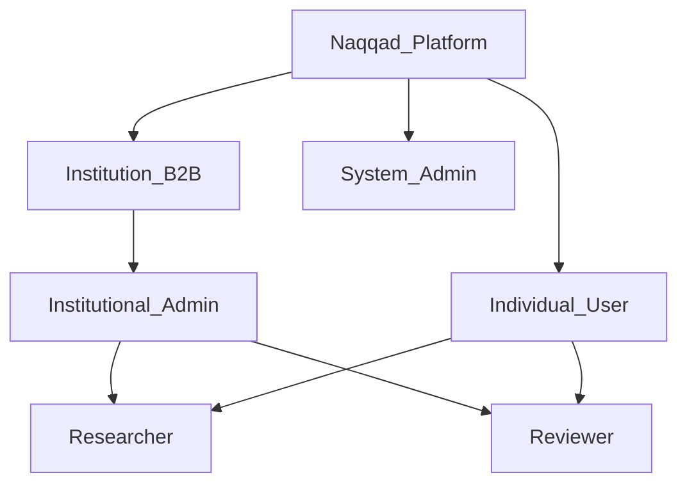
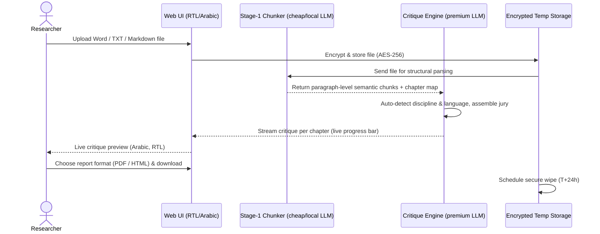
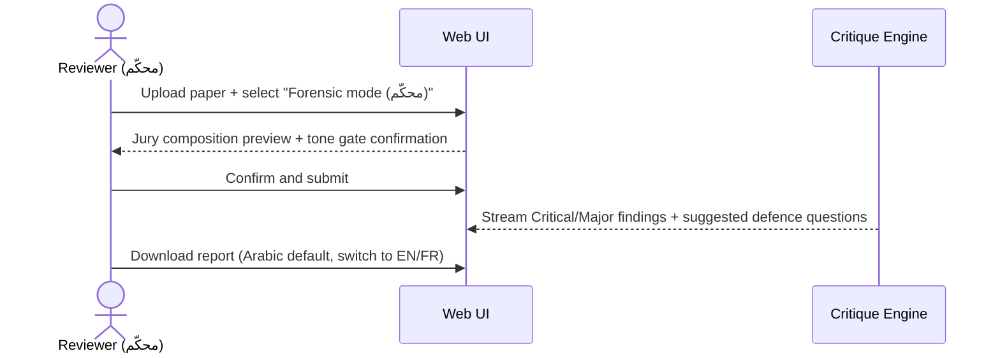
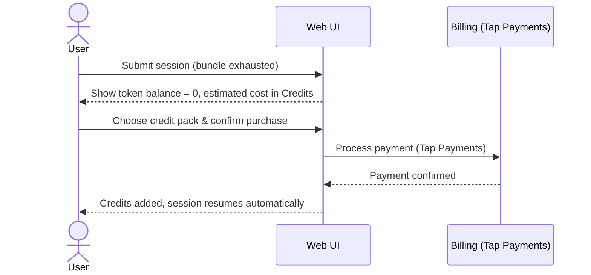
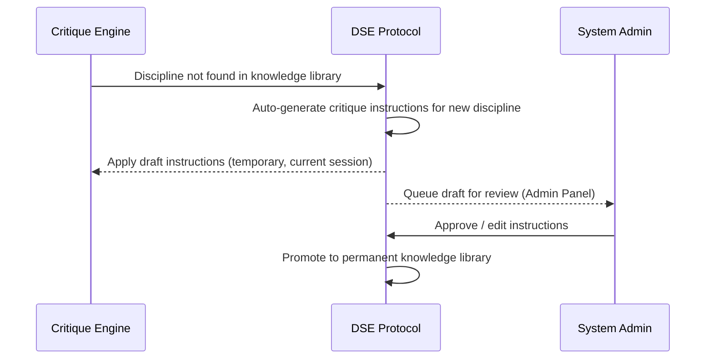
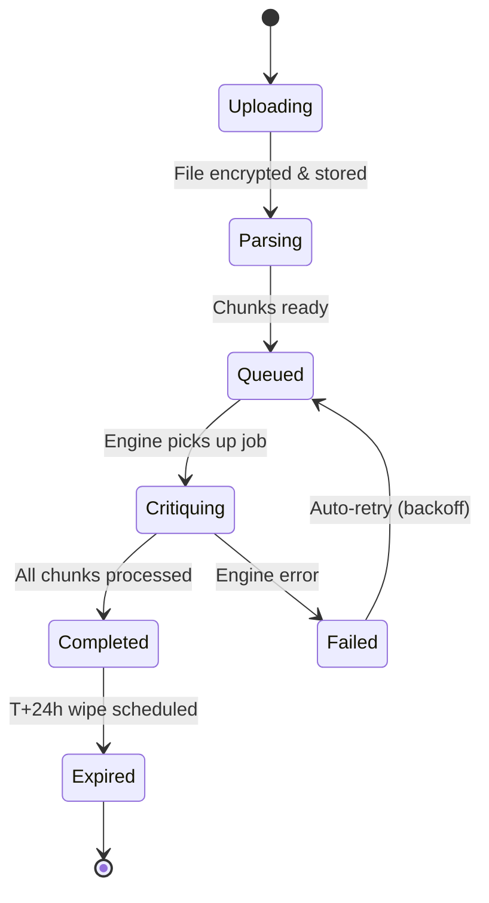
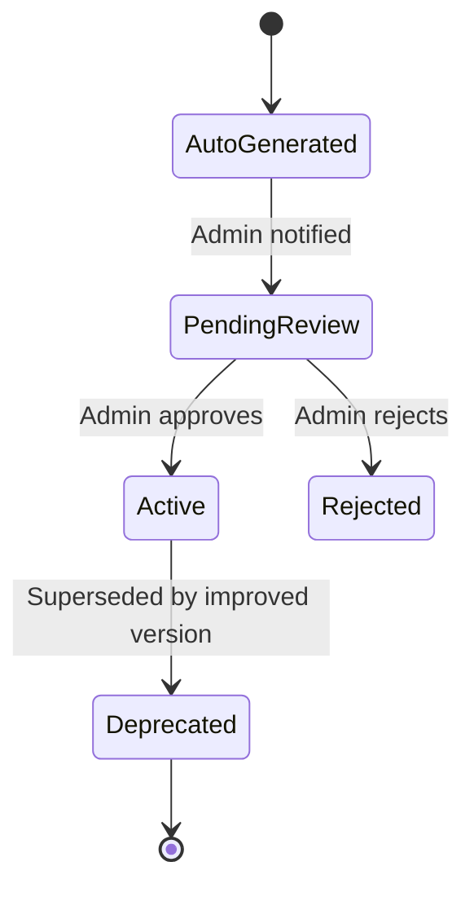

# Product PRD — Naqqad (نَقّاد): Arabic-First AI Academic Review Platform

**Trigger:** Starting a new product — aligning the full team on the big picture before feature work begins.
**Output:** A shared mental model — not a ticket list.

**ID:** PRD-001
**Type:** High-Level
**Author:** Product Management
**Date:** 2026-06-16
**Status:** Draft — Pending Review
**Target release:** Q4 2026 (Phase 1)
**Version:** 1.0

## Changelog
| Version | Date | Author | Changes |
|---|---|---|---|
| 1.0 | 2026-06-16 | Product Management | Initial draft |

---

## 1. Overview

Naqqad (نَقّاد — Arabic for "the rigorous critic/analyst") is an Arabic-first sovereign AI platform that acts as a **Virtual Defense Committee** (مجلس مناقشة افتراضي) for academic research. Researchers and academic reviewers upload theses or papers and receive expert-level critique from a dynamically assembled multi-specialist jury — all within minutes, in Arabic by default, with a hard guarantee that every file is destroyed after 24 hours. The platform targets the MENA academic market first, where demand for rigorous, confidential, fast-turnaround peer review is unmet by existing general-purpose AI tools.

---

## 2. Problem Statement

Arabic-speaking researchers face four compounding problems:

1. Supervisors expert only in narrow sub-fields leave interdisciplinary work under-reviewed.
2. Waiting weeks for human feedback slows thesis progress.
3. General AI tools (ChatGPT etc.) cannot hold 1,000-page documents as coherent context and hallucinate citations.
4. Uploading unpublished work to cloud platforms risks data retention and idea theft — a real deterrent in the MENA research community.

No existing product solves all four together, and none are Arabic-first.

---

## 3. Business Model

**Model type:** B2C (primary, Phase 1) + B2B Institutional (Phase 2)

**Role hierarchy:**

### Pricing Tiers

**Model:** Subscription (SaaS) with a token bundle per tier. When the monthly token bundle is exhausted, users continue by spending pre-purchased Credits.

| Tier | Price (USD/month) | Monthly Token Bundle | Credits when exhausted | Notes |
|---|---|---|---|---|
| **Free** | $0 | 20-page limit per session | Not available | BYOK only (user's own API key), watermarked PDF output |
| **Starter (باحث)** | $9 | 500K tokens (~150 pages) | $0.02 / 1K tokens | Researcher-focused, all report depths |
| **Pro (محقق)** | $29 | 2M tokens (~600 pages) | $0.016 / 1K tokens | Researcher + Reviewer modes, priority queue |
| **Scholar (عالِم)** | $79 | 8M tokens (~2,400 pages) | $0.012 / 1K tokens | Full access, institutional style guide upload, API access |

**Credit packs** (purchasable any time, never expire):
- 1M tokens → $15
- 5M tokens → $60
- 20M tokens → $200

**Key pricing rules:**
- Token spend is tracked at the session level. Stage-1 (chunker) tokens are not billed — only Stage-2 (critique) tokens count toward the bundle.
- Unused monthly tokens do not roll over.
- Free tier does not gain access to Credits — users must upgrade to a paid tier.

---

## 4. Business Goals

1. Establish Naqqad as the **go-to Arabic-language academic AI review tool** in the Gulf and MENA region within 12 months of launch.
2. Achieve **positive unit economics per critique session** from day one via the two-stage LLM pipeline (cheap chunker → premium critique model).
3. Build a **proprietary discipline knowledge library** (DSE Protocol output) that compounds as a competitive moat — each new specialisation reviewed improves the platform for all future users.
4. Create a **trust-by-design** product: the zero-retention architecture is a marketing differentiator, not just a compliance feature.
5. Capture institutional (B2B) accounts starting Phase 2 — universities and research centres as subscription clients.

---

## 5. Success Metrics

| Metric | Baseline | Target (6 months post-launch) |
|---|---|---|
| Critique completion time (100-page paper) | — | < 5 minutes |
| Arabic-language session share | — | ≥ 80% |
| Token cost per session (100 pages, Stage-2 only) | — | ≤ 40% of naive single-model cost |
| User satisfaction score (in-report feedback) | — | ≥ 4.2 / 5 |
| DSE new-discipline auto-generation success | — | ≥ 90% valid on first attempt |
| Free → paid tier conversion | — | ≥ 12% |
| Paid → Credits upsell rate (when bundle exhausted) | — | ≥ 35% |
| 24-hour data deletion compliance | — | 100% (auditable) |

---

## 6. User Roles & Permissions

| Role | Description | Key goal |
|---|---|---|
| **Researcher (باحث)** | Student or independent researcher uploading their own work | Constructive critique to improve the paper before submission or defence |
| **Reviewer (محكّم)** | Examiner, committee member, or journal editor reviewing someone else's work | Forensic critique to identify weaknesses, generate defence questions |
| **Institutional Admin** | University or research centre account manager | Upload style guide, set institutional defaults, monitor team usage |
| **System Admin** | Platform operator (internal team) | Approve DSE-generated discipline instructions, monitor system health, manage billing |

**Permissions matrix:**

| Action | Researcher | Reviewer | Inst. Admin | System Admin |
|---|---|---|---|---|
| Upload paper (Word / TXT / Markdown) | ✓ | ✓ | — | — |
| Select jury composition | ✓ | ✓ | — | — |
| Choose report depth (Executive / Standard / Deep Audit) | ✓ | ✓ | — | — |
| Switch critique tone (Constructive / Forensic) | ✓ | ✓ | — | — |
| Download report (PDF / HTML) | ✓ | ✓ | — | — |
| Purchase Credits or upgrade tier | ✓ | ✓ | ✓ | — |
| Upload institutional style guide | — | — | ✓ | ✓ |
| Approve new DSE discipline instructions | — | — | — | ✓ |
| View system-wide usage & task queue | — | — | ✓ | ✓ |
| Manage user accounts & credits | — | — | — | ✓ |

---

## 7. Core User Journeys

### 7.1 Researcher: Submit paper and receive critique

### 7.2 Reviewer: Forensic critique for examination

### 7.3 Token bundle exhausted — Credits flow

### 7.4 DSE: New discipline auto-generation

---

## 8. Solution Overview

1. **Arabic-First Interface:** RTL-native web UI designed from the ground up in Arabic — not a translated LTR layout. Arabic is the default; EN/FR available via a language switcher.
2. **Two-Stage LLM Pipeline:** A cheap or local model (Mistral-small / Gemma-3) parses and chunks documents structurally. A premium model (Gemini / Claude) performs critique only on the structured chunks. Stage-1 tokens are not billed to the user — only critique tokens count.
3. **Dynamic Jury Assembly:** Auto-detects the research discipline and assembles up to three specialist personas (e.g. فقيه + linguist + domain expert) whose critique instructions are merged via the Hybrid Synthesis protocol.
4. **DSE Self-Learning Protocol:** When a new discipline is encountered, the system generates critique standards automatically, serves the current user immediately with the draft, and queues it for admin approval before permanent adoption.
5. **Bidi-Aware Critique:** Treats mixed Arabic+Latin as the norm — Arabic body text, English technical terms, Latin citations, and mathematical notation handled correctly in both parsing and output.
6. **Zero-Retention Architecture:** Every file and report is encrypted at rest (AES-256), transmitted over TLS 1.3, and securely wiped after 24 hours with no exceptions.
7. **Flexible Report Output:** Reports are delivered as downloadable PDF (Arabic-optimised typography) and/or HTML (embeddable, linkable). Input is Word (.docx), plain text (.txt), or Markdown (.md) — no PDF upload.

---

## 9. Business Rules

- **Strict data retention:** No file or report can be recovered after 24 hours under any circumstance. Non-negotiable.
- **No ghostwriting:** The system provides critique and suggestions only — it does not rewrite or complete the research.
- **Token billing:** Only Stage-2 (critique) tokens count against the user's bundle or credits. Stage-1 (chunker) is platform cost, not user cost.
- **Credits never expire:** Purchased credit packs carry over indefinitely; monthly token bundles do not roll over.
- **DSE ownership:** Every approved discipline instruction set becomes part of the shared platform knowledge library.
- **BYOK fair use:** Free-tier accounts are rate-limited (per-hour request cap) to prevent resource abuse. BYOK users may not purchase Credits — they must upgrade.
- **Arabic default:** All new accounts default to Arabic UI and Arabic report output unless explicitly changed.
- **Tone gate:** The user must explicitly acknowledge the critique tone (Constructive vs. Forensic) on the submission screen before the critique runs. This acknowledgement is logged.
- **Input formats only:** Accepted upload formats are Word (.docx), plain text (.txt), and Markdown (.md). PDF upload is not supported in Phase 1.

---

## 10. Status Flows

### 10.1 Critique Session

### 10.2 DSE Discipline Instruction

| Status | Admin Dashboard label | API value |
|---|---|---|
| AutoGenerated | قيد الإنشاء التلقائي | `draft` |
| PendingReview | بانتظار المراجعة | `pending_review` |
| Active | نشط | `active` |
| Rejected | مرفوض | `rejected` |
| Deprecated | قديم | `deprecated` |

---

## 11. Design

### Web (primary platform — Phase 1)

- **Landing / Auth** — Arabic hero section, sign up / log in, zero-retention trust banner, pricing page
- **Dashboard (الرئيسية)** — active sessions, token balance + tier badge, recent reports, credit pack upsell when balance is low
- **Upload & Configure (رفع بحث)** — file upload (Word / TXT / MD) → auto-detected discipline + language preview → jury composition card → tone gate (Constructive / Forensic) → report depth selector → submit
- **Critique View (عرض النقد)** — streaming chapter-by-chapter output, severity badges (Critical / Major / Minor / Editorial), per-chapter progress bar, token usage counter
- **Report (التقرير)** — full structured report, download as PDF or HTML, in-report feedback (thumbs + comment)
- **Billing (الاشتراك والرصيد)** — current tier, token usage this month, credit balance, upgrade / buy credits (Tap Payments)
- **Admin Panel** — DSE review queue, system health dashboard, user management, usage analytics

UI direction: RTL-native. Mobile-responsive web — no native app in Phase 1, but web must be fully usable on mobile browsers.

**Figma:** TBC

---

## 12. Macro Data Model

- **User:** account holder; has a role (Researcher / Reviewer), language preference, current tier, token balance (monthly + credits), optional institution link
- **Subscription:** links a user to a tier; tracks billing cycle, monthly token allotment, renewal date
- **CreditLedger:** debit/credit log per user; linked to Tap Payments events and session token consumption
- **Institution:** B2B account (Phase 2); owns a style guide; has one or more admins and members
- **CritiqueSession:** core entity; links a user, an uploaded file, jury configuration, tone, report depth; has a status lifecycle; auto-expires at T+24h
- **UploadedFile:** encrypted blob reference (Word / TXT / MD); belongs to one session; destroyed on session expiry
- **Chunk:** structural unit produced by Stage-1 parser; belongs to a session; carries chapter/section metadata and token count
- **CritiqueReport:** structured output per session; exportable as PDF and HTML; destroyed with the session at T+24h
- **DisciplineInstruction:** DSE-generated or human-authored critique standard for a discipline; has approval status; belongs to the platform knowledge library (persistent)

---

## 13. Integration Points

| System | Purpose |
|---|---|
| **Stage-1 LLM** (Mistral-small / Gemma-3 / local) | Structural parsing & semantic chunking — cheap, high-volume, not billed to users |
| **Stage-2 LLM** (Gemini / Claude) | Critique generation — premium, tokens billed against user bundle/credits |
| **Tap Payments** | Subscription billing, credit pack purchases; supports Visa/Mastercard, MADA, local wallets across Egypt + GCC |
| **WeasyPrint / ReportLab** | PDF report generation with RTL Arabic typography and bidi support |
| **Object Storage** (S3-compatible) | Encrypted temporary file storage with TTL lifecycle rules for 24h auto-delete |

---

## 14. Non-Functional Requirements

- **Performance:** 100-page critique completed in < 5 minutes via parallel chunk processing
- **Scale:** Concurrent sessions managed via task queue (Celery or equivalent) with backpressure
- **Security:** AES-256 at rest, TLS 1.3 in transit; prompts stored server-side only, never exposed to frontend; secure wipe at T+24h
- **Privacy:** Zero data retention after session expiry; no user data used for model training
- **Resilience:** Auto-retry with exponential backoff on LLM provider errors; multi-provider fallback for Stage-2
- **RTL/i18n:** All UI components, PDF output, and error messages support Arabic RTL natively; bidi rendering for mixed Arabic+Latin content
- **Accessibility:** WCAG 2.1 AA; Arabic screen-reader compatibility

---

## 15. Scope

### In scope (Phase 1)
- Arabic-first RTL web UI (EN/FR as secondary options)
- File upload: Word (.docx), plain text (.txt), Markdown (.md) — up to 1,000 pages
- Report output: PDF (Arabic-optimised) and HTML
- Two-stage LLM pipeline (cheap chunker + premium critique)
- Dynamic jury assembly (up to 3 specialist personas)
- DSE protocol (auto-generate + admin approval queue)
- Three report depths: Executive / Standard / Deep Audit
- Constructive and Forensic critique modes with tone gate
- Mixed Arabic+Latin (bidi) handling
- Free BYOK tier (20-page limit, watermarked output)
- Subscription tiers with monthly token bundles (Free / Starter / Pro / Scholar)
- Credit packs for top-up when bundle exhausted
- Tap Payments integration (Egypt + GCC)
- 24-hour encrypted auto-delete
- Institutional style guide upload (Scholar tier)
- Mobile-responsive web

### Out of scope (Phase 1)
- PDF file upload (output only)
- Native mobile apps (iOS / Android)
- Track-Changes injection into Word files
- Turnitin / plagiarism database integration
- LMS integration (Moodle, Blackboard etc.)
- Real-time collaboration on reports
- Institutional B2B accounts (Phase 2)
- English or French as primary market focus

---

## 16. Dependencies

- Stage-1 LLM selection: benchmark Mistral-small vs Gemma-3 vs fine-tuned local model on Arabic academic documents (.docx / .md)
- Stage-2 LLM provider agreements (Gemini / Claude API access + rate limit tiers)
- Tap Payments merchant account setup and API integration
- PDF library with production-grade Arabic RTL rendering (WeasyPrint vs ReportLab evaluation spike)
- S3-compatible object storage with configurable TTL lifecycle policies

---

## 17. Risks

| Risk | Likelihood | Impact | Mitigation |
|---|---|---|---|
| AI hallucination in citations | Medium | High | Self-critique layer; model instructed to verify references exist in the uploaded text only |
| LLM API rate limits at scale | High | High | Key rotation, task queue with backoff, multi-provider fallback |
| Arabic PDF rendering quality | Medium | High | Early spike on WeasyPrint vs ReportLab for Arabic RTL; build PDF regression test suite |
| Researcher distrust of cloud upload | Medium | High | Aggressive communication of 24h delete policy; transparent encryption docs on landing page |
| Prompt injection via uploaded content | Low | Medium | Prompts isolated server-side; uploaded content treated strictly as data, never as instructions |
| Stage-1 chunker quality on complex Arabic .docx | Medium | Medium | Benchmark on Arabic academic corpus before committing to model; define chunk quality metrics |
| Tap Payments integration delays | Low | Medium | Start merchant account setup early; have PayTabs as fallback |

---

## 18. Open Questions

1. Which specific model serves as Stage-1 chunker? (Benchmark needed: Mistral-small vs Gemma-3 vs local fine-tune on Arabic academic .docx and .md)
2. WeasyPrint vs ReportLab — which achieves production-quality Arabic RTL with bidi content? (Spike required before PDF feature PRD)
3. What is the exact token-to-page conversion rate for pricing? (Depends on average Arabic academic document density — needs measurement)
4. Does Scholar tier institutional style guide upload ship in Phase 1 or Phase 1.5?
5. What is the rate-limit cap for BYOK free-tier accounts (requests/hour)?
6. Is the Admin Panel for DSE review built as a standalone internal tool or integrated into the main web app?

---

## 19. Glossary

| Term | Definition |
|---|---|
| **Naqqad (نَقّاد)** | The platform name. Arabic for "the rigorous critic/analyst" — the term used in Arabic academic culture for a serious scholarly examiner. |
| **Virtual Defense Committee (مجلس مناقشة افتراضي)** | The core metaphor: Naqqad assembles a panel of AI specialists that mimics a real thesis defence committee. |
| **DSE Protocol** | Deep Semantic Enhancement — the self-learning mechanism that automatically generates critique standards when a new academic discipline is encountered. |
| **Semantic Batching** | Splitting a document into topic-coherent chunks (respecting chapter and section boundaries) rather than arbitrary page breaks, to preserve context across LLM calls. |
| **Stage-1 LLM** | The cheap or local model used purely for structural parsing and semantic chunking. Performs no critique. Its token cost is absorbed by the platform, not billed to the user. |
| **Stage-2 LLM** | The premium model (Gemini / Claude) that performs actual critique, receiving only structured chunks. Token usage counts against the user's monthly bundle or credits. |
| **Token Bundle** | The monthly allocation of critique tokens included in each subscription tier. Does not roll over. |
| **Credits** | Pre-purchased tokens (never expire) used when the monthly bundle is exhausted. Purchasable in packs via Tap Payments. |
| **Bidi** | Bidirectional text — the norm in Arabic academic documents: Arabic (RTL) body text mixed with English/Latin (LTR) technical terms, citations, and formulas. |
| **BYOK** | Bring Your Own Key — the free tier where the user provides their own LLM API key. Limited to 20 pages per session, watermarked output, no Credits access. |
| **Zero-Retention** | Platform policy: all session files and reports are securely wiped 24 hours after upload. No exceptions, no recovery. |
| **Forensic Mode** | Reviewer-facing critique tone: adversarial, designed to expose weaknesses and generate examination questions. |
| **Constructive Mode** | Researcher-facing critique tone: supportive and improvement-oriented. |
| **Tone Gate** | The mandatory confirmation step on the submission screen where the user explicitly acknowledges which critique tone they have selected. |
| **TTL (Time-To-Live)** | The 24-hour countdown on encrypted session storage before automatic secure deletion triggers. |
| **Tap Payments** | The selected payment provider, covering Egypt and GCC countries (Saudi Arabia, UAE, Kuwait, Bahrain, Qatar). |
